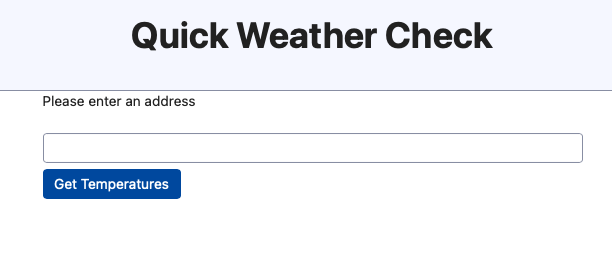
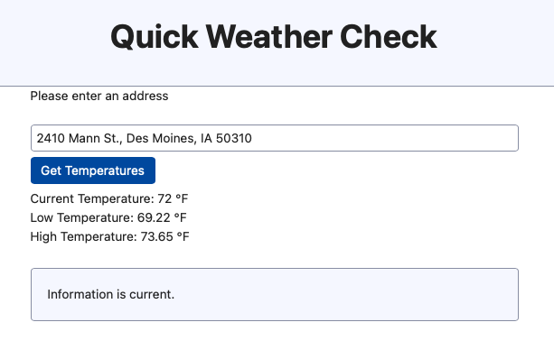
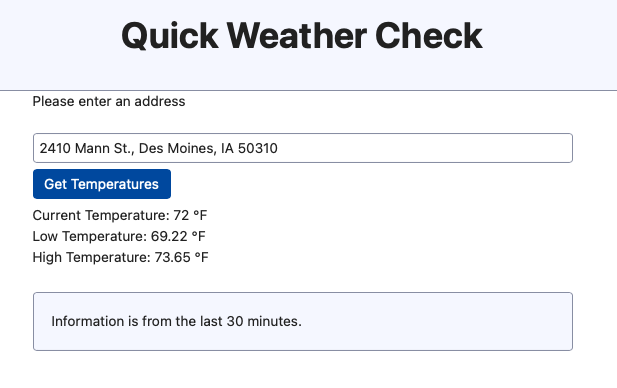
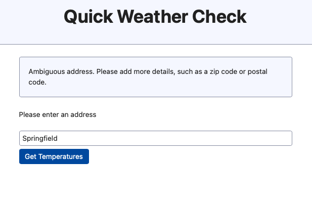

# Quick Weather Check
## Contents
- [Introduction](#introduction)
- [Requirements](#requirements)
- [Setup](#setup)
- [Actions](#actions)
- [Screenshots](#screenshots)
- [Discussion](#discussion)
## Introduction
Quick Weather Check allows the user to enter an address and receive the current temperature,
low temperature, and high temperature. The results are cached for 30 minutes by postal code
(zip code in the US). Results are not cached for countries without postal codes. See [Discussion](#countries-without-postal-codes) for more info. All text displayed to the user is localizable.
## Requirements
This coding exercise has the following requirements:
- Must be done in Ruby on Rails
- Accept an address as input
- Retrieve forecast data for the given address. This should include, at minimum, the
current temperature (Bonus points - Retrieve high/low and/or extended forecast)
- Display the requested forecast details to the user
- Cache the forecast details for 30 minutes for all subsequent requests by zip codes.
Display indicator if result is pulled from cache.
## Setup
[Install Ruby](https://www.ruby-lang.org/en/documentation/installation/) and [install Rails](https://guides.rubyonrails.org/getting_started.html) if needed.

Ruby version: 3.3.5

Rails version: 7.2.1

Run the setup script, which runs bundle install. This app does not need a database, so it was created with `rails new quick_weather --skip-active-record`
```
bin/setup
```
### OpenWeatherMap API key
Sign up for a free OpenWeatherMap API key, available [at openweathermap.org](https://openweathermap.org/price). Note that the free subscription gives access to the 2.5 version of the API, not the 3.0 version that includes extended forecasts.

Create a `.env` file in the top-level directory of the project, and add
```
OPENWEATHERMAP_API_KEY=your_openweathermap_key
```
### HERE API key
Sign up for a free API key for the HERE geocoding service, available [at here.com](https://www.here.com/docs/bundle/geocoding-and-search-api-developer-guide/page/topics/quick-start.html%20#). You will also receive a organization ID, which is not needed to make API calls.

Add a line to the `.env` file
```
HERE_API_KEY=your_here_key
```
### Enable Rails cache in development
```
bin/rails dev:cache
```
## Actions
### Run the test suite
```
bundle exec rspec
```
### Run the server
```
bin/rails s
```
### Try the site
- Visit `localhost:3000`
- Enter an address
- Click Get Temperatures. Note "Information is current." message
- Click Get Temperatures again. Note "Information is from the last 30 minutes." message
## Screenshots
Visit to localhost:3000 without params



With a valid address, fresh results



With a valid address, cached results



With an ambiguous address




## Discussion
### Scalability
The app is using the default Rails cache. For a production application, the cache
should be upgraded to use [Redis](https://redis.io) or a similar tool.

The results from the HERE geocoder service could also be cached if needed.

For high loads, Rails servers can be scaled via Kubernetes or AWS EC2 instances. Operating
agreements would be needed with the external services HERE and OpenWeatherMap to agree on
the scale of traffic that is supported and what happens if a service goes down or starts
returning unexpected results.
### Frontend
I looked at adding [Boostrap](https://getbootstrap.com), but it added a lot of files and code
for not much benefit. For a production app, it might be a better return on investment. I used
[SimpleCSS](https://simplecss.org) instead.
### Form submission
I used GET for the form submission rather than POST so that users can share a link to a specific
address. It would be straightforward to change the form action to POST for improved security.
### Extended forecast
With an upgrade to the OpenWeatherMap 3.0 API, it would be straightforward to add
the extended forecast in WeatherService by retrieving it from the results, adding
it to the returned hash, and displaying it on `weather_info/show.html.erb`.
### Countries without postal codes
A few countries do not have postal codes. I chose not to cache those countries' results. In
production this would be a vulnerability to overload the OpenWeatherMap server with too many
calls, which would also lead to high costs.

It would be possible to cache a result for the whole country, or use an alternate key. This change
could easily be made in `GeoLocation#key`, with any additional fields added in `GeocodeService#parse_response`.

Further research would be needed to understand the correct granularity of caching for those countries.
See [2024 list of countries without postal codes](https://worldpopulationreview.com/country-rankings/countries-without-postal-codes).
### Object Decomposition and Design Patterns
`WeatherInfoController` inherits from `ApplicationController`. It has a show action and template
that allow the user to enter an address and then show the results.

Two Service objects inherit (implicitly) from `Object`. `GeocodeService` calls the HERE API and
parses the results. `WeatherService` calls the OpenWeatherMap API and parses the results.

Initially, information was passed from `GeocodeService` to `WeatherService` in a hash. When some
of this information was used to create a cache key, it became clear that this could be a
separate object with `#key` and `#valid?` methods. I extracted the `GeoLocation` object
inheriting (implicitly) from `Object`.
